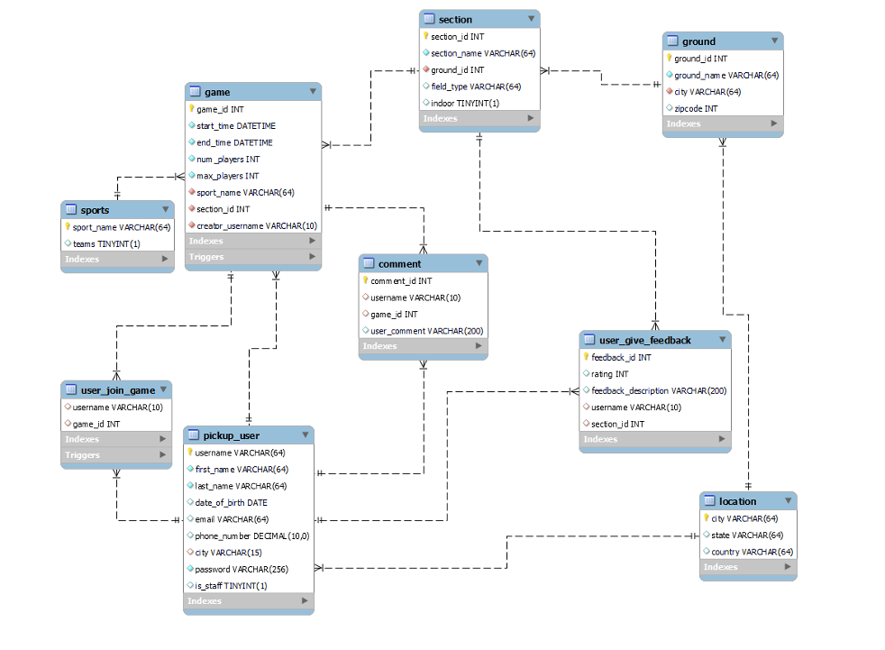

# DBMS Project Report

**Introduction:**

‘Pickup Sports’ is a platform that contains real-time information about current and upcoming
pickup games happening on numerous grounds in a city. If someone is new to a city, or someone
who does know a lot of people who play a particular sport, many times they can find themselves
struggling to find pickup games around them. Most plans are created on Facebook or WhatsApp
groups, however, this poses an issue for people who are not a part of these groups as it is difficult
to find such groups. This application aims to solve that by providing a centralized system where
individual players can find games, and a group can find additional players if needed.

## README:

Steps for running the project:

1. Install all dependencies (Refer to the dependencies section below). We have provided
    requirements.txt as well.
2. Go to root folder -> pickupSports -> pickupSports -> settings.py. In the DATABASES
    variable set your MySQL username and password.
3. Now, go to root folder - > pickupSports and run command ‘python manage.py migrate’
4. Now, go to root folder -> pickupSports and run the command ‘python manage.py
    runserver’
5. Project will be running on [http://127.0.0.1:8000/](http://127.0.0.1:8000/)

We have loaded the project with 3 users. One of them is an administrator with additional
functionality of adding cities, ground, and sections and also updating sections.

Username for administrator: ‘manager’. Password: ‘Dbmsproject@123’

Other 2 users:

Username: ‘prathams28’. Password: ‘Dbmsproject@123’

Username: ‘ritika’. Password: ‘Dbmsproject@123’

You can create your account using our registration for user and registration for manager. We have
added different games for ‘prathams28’ and ‘ritika’ on the grounds in Boston.

You can test analytics for the city of Boston as well as Los Angeles as we have added a few
games for Los Angeles so that you can see its analytics. Change city to Los Angeles for its
analytics.

You can change city for the account using the ‘change city’ button and it will change the grounds
and section for game creation and games will also be changed according to city. You will see
analytics for whichever city is selected.


Using the administrator, you can add cities, grounds, and sections by clicking ‘View sections’
and ‘View grounds’.

You can add feedback using ‘Create feedback’ and to add comments to games you can click on
‘View Games’ and you will be able to see comments for the games you created or joined and
comments if you wish to.

On clicking ‘View games’, you will be able to update or delete the games you created and you
will be able to leave a game you joined and it’ll delete your record associated with that game.

**Dependencies:**

```
1) Python 3.9+ (https://www.python.org/downloads/)
2) Django (pip install django)
3) Requests (pip install requests)
4) Phonenumbers (pip install phonenumbers)
5) Cryptography (pip install cryptography)
6) Matplotlib (pip install matplotlib)
7) Seaborn (pip install Seaborn)
```

ER Diagram (Conceptual Design) :


Logical Design:




Activity diagram for user:


Activity diagram for administrator: An administrator retains all functionality of a normal user
while having the additional functionality of adding and updating cities, grounds, and sections.


**Lessons Learned:**

**1. Technical expertise gained:**
    **a.** We gained extensive knowledge of designing a database from the ground up and
       maintaining it throughout various iterations of the project.
    **b.** We learned how to compartmentalize code at different levels such as front-end,
       back-end, and database level.
    **c.** We learned how to effectively integrate the back-end of an application with a
       database.

**Future work:**

**1. Planned uses** : This database can be hosted and used as a central source of information
    for pickup games in a given city. Analytics can be generated such as popular time, and
    popular ground, for particular sports which can help people find like-minded people. It
    can serve as a community wanting to play the sport of their choice wherever they are.
**2. Potential areas of added functionality:**
    **a.** We can store users’ favorite sports and push a notification to that user each time a
       game for that sport is created in the user’s city.
    **b.** We can store the user’s favorite grounds and push a notification when a game is
       added to those grounds.
    **c.** We plan on adding the functionality of creating tournaments.
    **d.** We plan on adding the functionality where users can add other users as their
       friends and invite those friends to games.

**Bonus Work Completed:**

**1.** Created a front-end functionality in the form of a website.
**2.** Wrote queries for data analytics.
**3.** Our application supports multiple users. One is a normal user and another is a manager
    which has the added functionality of adding, updating, and deleting grounds, sections,
    sports, and cities.
**4.** Multiple queries require multi-joins.
**5.** Visualized data of a few tables in our database.
**6.** Overly complicated translations from user operations to database operations.


